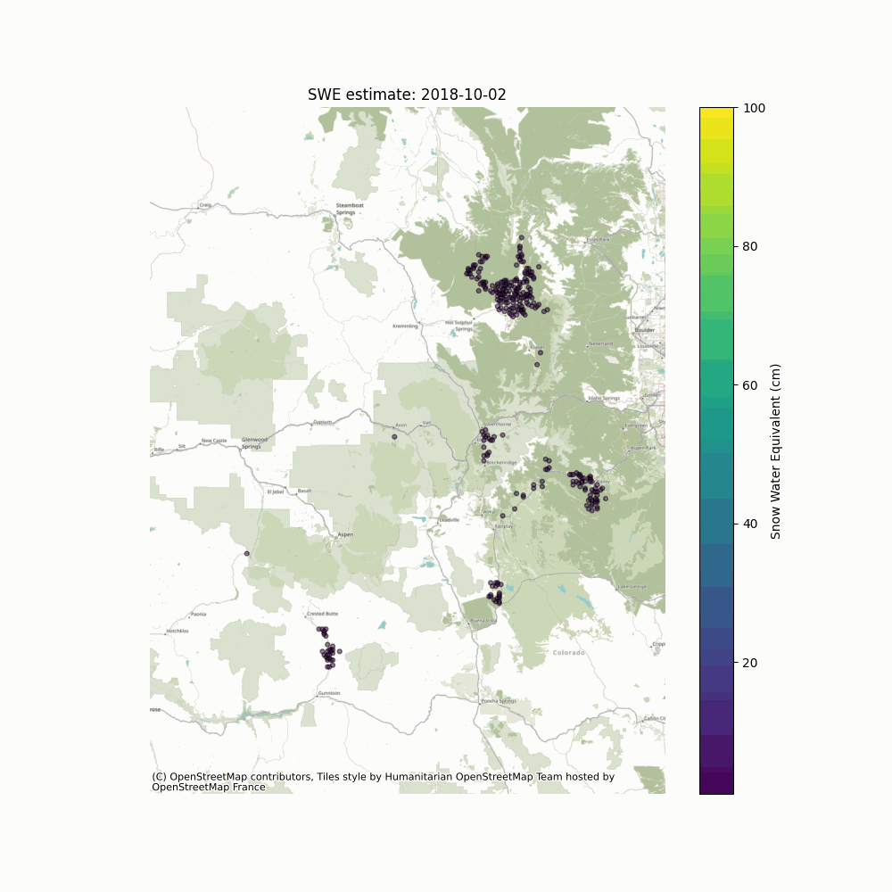
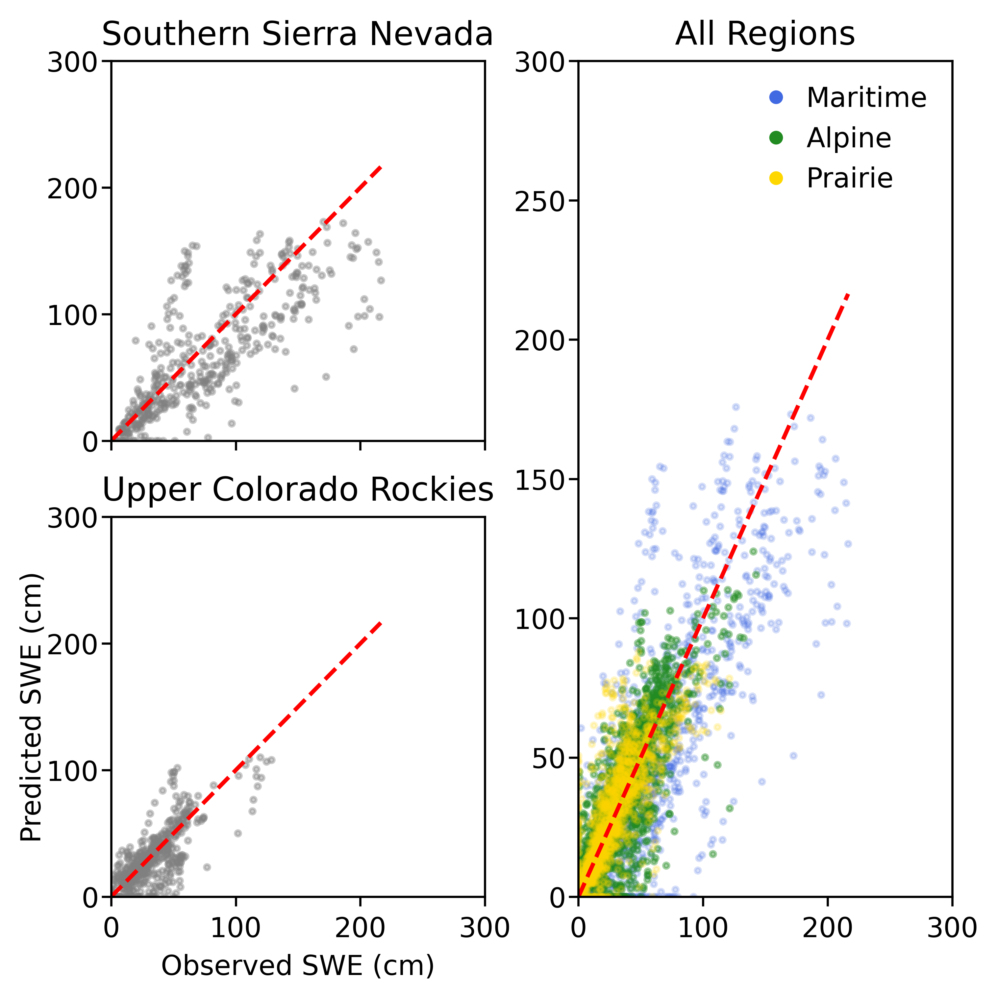
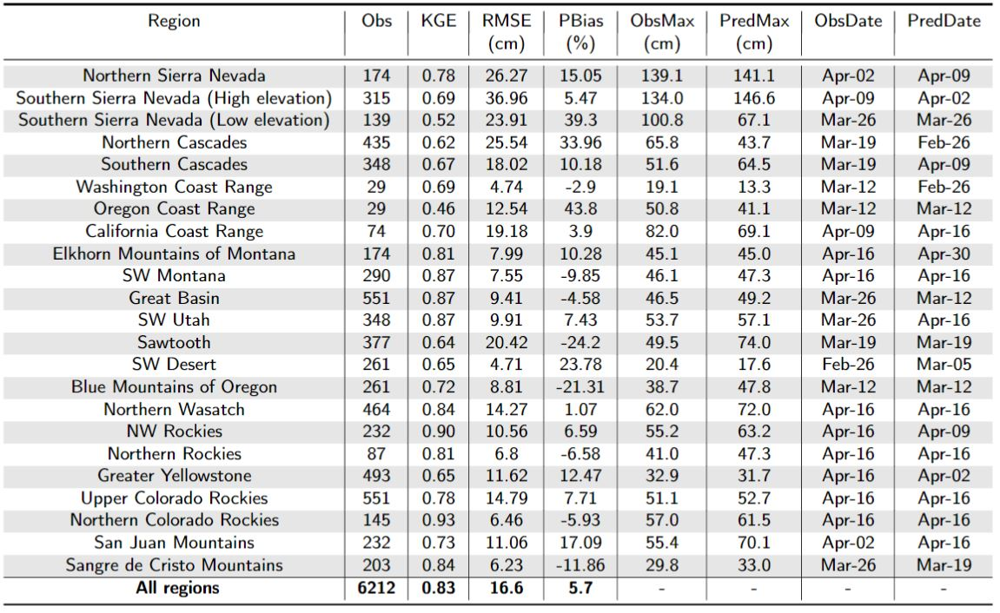
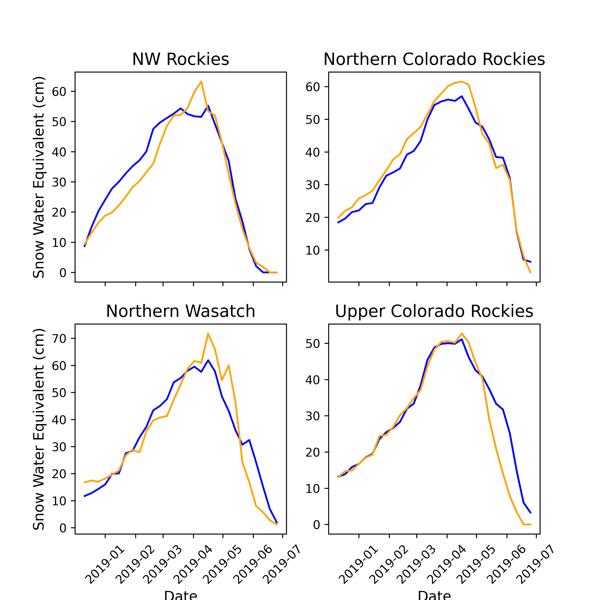
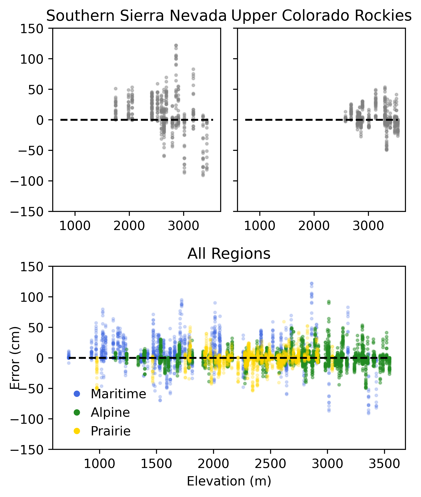
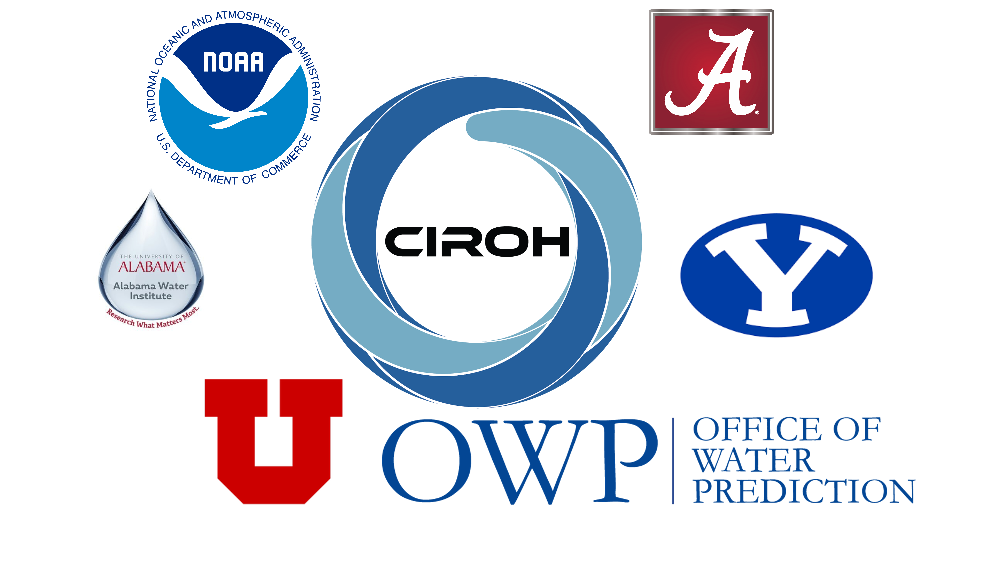

# Snow Water Equivalent Machine Learning (SWEML): Using Machine Learning to Advance Snow State Modeling

## Deep Learning 1 km resolution SWE prediction model
The current iteration of the SWEML produces 11,000 1 km SWE inferences for select locations throughout the Western U.S. plus the Upper Colorado River Basin.
There is a heavy focus on SWE inferences in the Sierra Nevada mountains, Colorado Rockies, and Wind River Range in Wyoming.
The NSM pipeline assimilates nearly 700 snow telemetry (SNOTEL) and California Data Exchange Center (CDEC) sites and combines with processed lidar-derived terrain features for the prediction of a 1 km x 1 km SWE inference in critical snowsheds.
The ML pipeline retrieves all SWE observations from SNOTEL and CDEC snow monitoring locations for the date of interest and processes the SWE observations into a model-friendly data frame alongside lidar-derived terrain features, seasonality metrics, previous SWE estimates, and location.
SWEML predicts SWE using a uniquely trained multilayered perceptron network model for each region and supports an interactive visualizaiton of the SWE estimates across the western U.S. 

Figure 1. Example hindcast simulation in the domain in Colorado.
SWE estimates around the timing of peak SWE for the domain in the Sierra Nevada mountains.

### Explore the current version of the model
To fast track to the current model and application, click the [Neural Network Model](https://github.com/whitelightning450/SWEML/tree/main/Model/Neural_Network) and explore the files.

## General Model Performance
In the current form, we train SWEML on 75% of the available NASA ASO observations and snow course surveys from the 2013-2018 period. 
General model development used the remaining 25% of the observations to test the model and we evaluate model performance using the [Standardized Snow Water Equivalent Tool (SSWEET)](https://github.com/whitelightning450/Standardized-Snow-Water-Equivalent-Evaluation-Tool) on a full hindcast of the 2019 water year.
A hindcast simulation prevents any data leakage from the training data, supports a robust investigation of the expected performance of SWEML in operations, and demonstrates a framework for performing retrospective simulations.
The below figures represent the results of the hindcast from the 2019 simulation.

Figure 2. SWEML estimates for three key snow classification types closely match the observed.

Table 1. SWEML produces high model skill for all regions

Figure 3. Regional average SWE estimates closely match the observations magnitude and timing (e.g., peak SWE, melt)

Figure 4. The error in SWE estimates for the three snow classification types vs. elevation.

## Data Sources (training, inference, where/how used)
Ground measurements for training were obtained from the provided SNOTEL and CDEC measurement file: ground_measure_features_template.csv

Latitude, Longitude, and Elevation for all measurement locations were obtained from the metadata file: ground_measures_metadata.csv

GeoJSON data for the submission format grid cell delineation were obtained through the grid_cells.geoJSON file. 

SWE training measurements for the submission format grid cells were obtained through the train_labels.csv

Using the above data, a training dataset was produced for the timespan measured in train_labels.csv. 
The submission grid cell IDs were identified by latitude and longitude into one of the twenty-three sub-regions. SNOTEL and CDEC measurements were also identified by coordinates and grouped by sub-region. 
Previous SWE and Delta SWE values were derived for each grid cell, and for each ground measurement site, as the previous measured or estimated SWE value at that location, and as the current measure or estimated SWE value - previous measure or estimated SWE value, respectively. 
Aspect and slope angle from the geoJSON data for each grid cell was converted to northness on a scale of -1 to 1. 
 
 
## Check out our Example Tutorial in the Upper Colorado River Basin
 
This use case library contains a summary of the motivation behind the project, applicable ML methods and tools, the methods for data preparation, model development including the model training framework and evaluation, workflow management demonstrated using GeoWeaver, links to the complete model on GitHub as the model is data-intensive the tutorial is for a subset of the entire model, a discussion/conclusion, and a solicitation to questions.
Below are the respective chapters addressing these items:

1. [Motivation](./book/chapters/motivation.ipynb)
2. [Machine Learning Methods and tools](./book/chapters/methods.ipynb)
3. [Data Preparation](./book/chapters/data.ipynb)
4. [Model Development and Parameter Tuning](./book/chapters/development.ipynb)
5. [Model Training](./book/chapters/training.ipynb)
6. [Evaluation of Model Performance](./book/chapters/evaluation.ipynb)
7. [Workflow Management and Cloud Computing](./book/chapters/workflow.ipynb)
8. [Reproducibility](./book/chapters/reproducibility.ipynb)
9. [Discussion/Conclusion](./book/chapters/conclusion.ipynb)
10. [Solicitation to Questions](./book/chapters/questions.ipynb)

## Dependencies (versions, environments)
Python: Version 3.8 or later

### Required packages

| os           | ulmo       | pandas             |
|:-----------: | :--------: | :----------------: | 
| io           | shapely    | datetime           |
| re           | rasterio   | matplot.pyplot     |
| copy         | lightgbm   |  numpy             |
| time         | tensorflow |  pystac_client     |
| tables       | platfrom   | planetray_computer |
| xarray       | tqdm       | random             |
| rioxarray    | geopandas  | requests           |
| pyproj       | richdem    | cartopy            |
| h5py         | elevation  | cmocean            |
| mpl_toolkits | hdfdict    | warning            |
| math         | pickle     |  contextily        |
|folium        | branca     |  earthpy           | 
|netCDF4       | osgeo      | requests           |
| warnings     | geojson    | fiona              |
|fiona.crs     |webbrowser  |                    |

## Project support through [CIROH](https://ciroh.ua.edu/)

